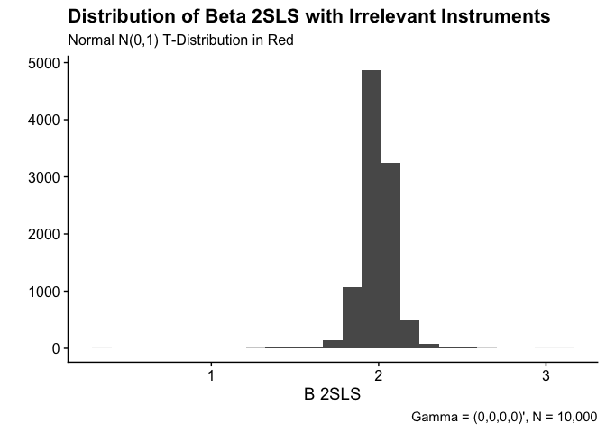
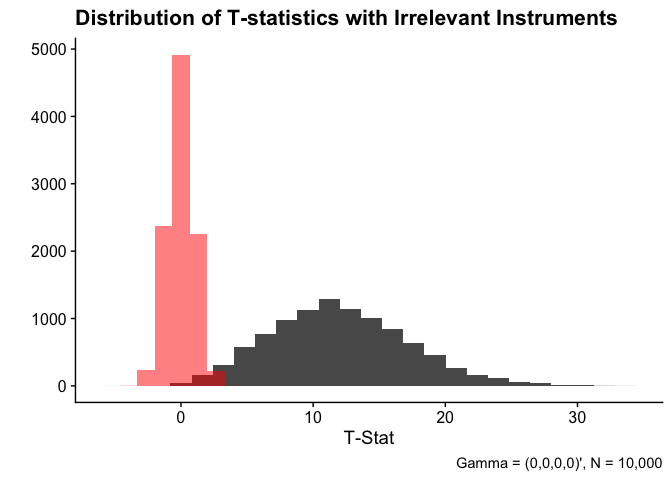
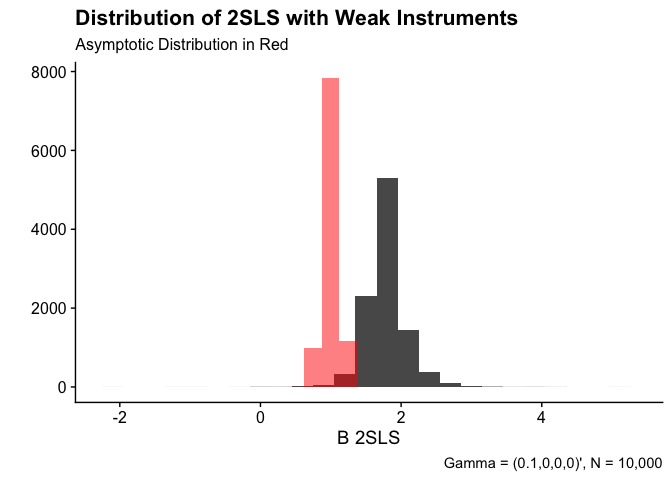
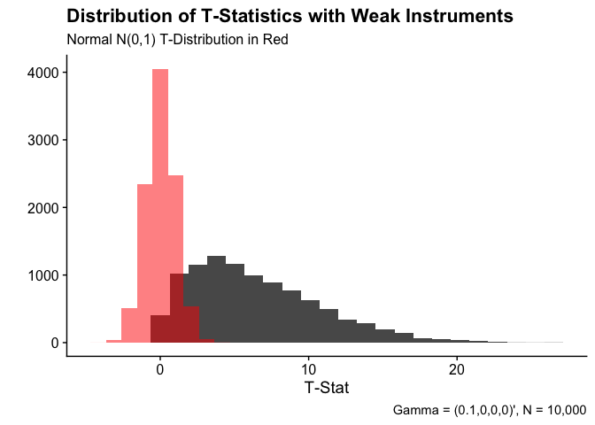
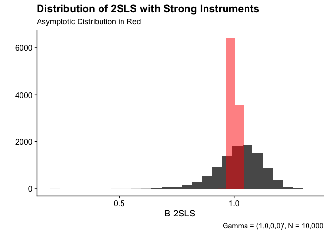
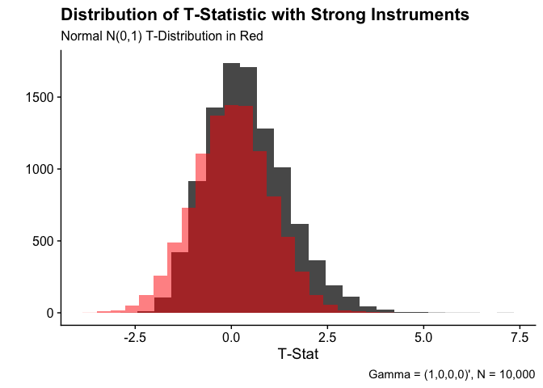

```r
# Load packages
pacman::p_load(tidyverse, ivreg, ivmodel, magrittr, ggplot2, MASS)
```


### MonteCarlo Function


```r
# Set parameters
b = 1
se = 1
sv = 1
p = .99
l = 4
n = 100 
mu_z = rep(0, l)
Qzz = diag(l)
N = 10000
```


```r
# Monte-Carlo function set-up
montecarlo = function(N, gamma){
  # Create empty vectors to put values into
  sim.beta = rep(NA, N)
  sim.se = rep(NA, N)
  t_stat = rep(NA, N)
  ci_lower = rep(NA, N)
  ci_upper = rep(NA, N)
  and_rub = rep(NA, N)

  # Montecarlo loop. This will output all the statistics the question asked for
  for (sim in 1:N){
    # Simulate z's
    z = mvrnorm(n, mu_z, Qzz)
    # Simulate errors
    e_v = mvrnorm(n, rep(0, 2), matrix(c(se^2, rep(p, 2), se^2), ncol = 2))
    
    # Create x's
    x = z %*% gamma + e_v[,2]
    # Create y's
    y = x %*% b + e_v[,1]
    
    # Calculate 2SLS
    tsls = ivreg(y ~ x | z)
    
    # Store values of interest from regression
    sim.beta[sim] = coef(tsls)[2] 
    sim.se[sim] = broom::tidy(tsls)[2,3] |> as.numeric()
    
    # Calculate t-stat
    t_stat[sim] = (sim.beta[sim] - b) / sim.se[sim]
    
    # Calculate confidence interval
    ci_lower[sim] = sim.beta[sim] - 1.96*sim.se[sim]
    ci_upper[sim] = sim.beta[sim] + 1.96*sim.se[sim]
    
    # Create z projection matrix for use in anderson-rubin stat
    pz = z %*% solve(t(z)%*%z)%*%t(z)
    
    # IVmodel object for anderson-rubin function
    iv = ivmodel(y, x, z)
    
    # Calculate anderson-rubin stat
    test = AR.test(iv, beta0 = 1)
    and_rub[sim] = test$Fstat
    

  }

  # Store sensibly
  tsls_output = tibble(beta = sim.beta, 
                         se = sim.se,
                         t_stat = t_stat,
                         ci_lower = ci_lower,
                         ci_uppwer = ci_upper,
                         anderson_rubin = and_rub)
  
  # Decision for t-tests. 1 for reject 0 for fail to reject. Using this convention because it is   convenient for calculating the percent of rejections
  tsls_output %<>% mutate(t_decision = if_else(abs(t_stat) > 1.96, 1, 0))
  
  # Same for AR tests with the same convention
  f_crit = qf(0.95, l, n-l)
  tsls_output %<>% mutate(ar_decision = if_else(anderson_rubin > f_crit, 1,0))
  
  return(tsls_output)

}
```

### Instrument Tests

#### Irrelevant Instruments


```r
# Gamma is all zeros
gamma = rep(0, 4)

set.seed(123)
irrelevant = montecarlo(N, gamma)

# Histogram of 2sls with irrelevant instruments
irrelevant_b = irrelevant |> ggplot(aes(x = beta)) +
  geom_histogram(bins = 25) + 
  labs(x = "B 2SLS", y = "", title = "Distribution of Beta 2SLS with Irrelevant Instruments",
       subtitle = "Normal N(0,1) T-Distribution in Red",
       caption = "Gamma = (0,0,0,0)\', N = 10,000") +
  cowplot::theme_cowplot()

# Calculate the bias
bias_irrelevant = mean(irrelevant$beta) - b

# Histogram of t-stats
irrelevant_t = irrelevant |> ggplot(aes(x = t_stat)) + 
  geom_histogram(bins = 25) + 
  geom_histogram(data = data.frame(x = rnorm(N)), aes(x = x), fill = 'red', alpha = 0.5) + 
  labs(x = "T-Stat", y = "", title = "Distribution of T-statistics with Irrelevant Instruments",
       caption = "Gamma = (0,0,0,0)\', N = 10,000") +
  cowplot::theme_cowplot()

# Empirical size of t_tests
size_t_irr = sum(irrelevant$t_decision) / N

# Empirical size of Anderson-Rubin test
size_ar_irr = sum(irrelevant$ar_decision) / N
```

##### Printout of results

```r
head(irrelevant, 15)
```

```
## # A tibble: 15 × 8
##     beta     se t_stat ci_lower ci_uppwer anderson_rubin t_decision ar_decision
##    <dbl>  <dbl>  <dbl>    <dbl>     <dbl>          <dbl>      <dbl>       <dbl>
##  1  2.00 0.0561  17.9      1.89      2.11          1.56           1           0
##  2  2.01 0.0557  18.2      1.90      2.12          1.62           1           0
##  3  1.90 0.0747  12.1      1.76      2.05          0.958          1           0
##  4  2.00 0.112    8.92     1.78      2.22          0.484          1           0
##  5  1.99 0.127    7.77     1.74      2.23          0.361          1           0
##  6  1.99 0.0755  13.1      1.84      2.14          0.936          1           0
##  7  2.09 0.0943  11.5      1.90      2.27          0.619          1           0
##  8  1.98 0.0914  10.7      1.80      2.16          0.598          1           0
##  9  1.91 0.0766  11.9      1.76      2.06          0.989          1           0
## 10  1.99 0.0726  13.7      1.85      2.14          1.03           1           0
## 11  2.17 0.198    5.92     1.78      2.56          0.510          1           0
## 12  2.04 0.104   10.0      1.84      2.25          0.422          1           0
## 13  1.97 0.0756  12.8      1.82      2.12          0.948          1           0
## 14  2.00 0.0863  11.5      1.83      2.17          0.639          1           0
## 15  2.03 0.122    8.41     1.79      2.27          0.449          1           0
```


##### Part 1: Histogram of beta hat 2SLS

```r
irrelevant_b
```



##### Part 2: Bias 
For the irrelevant instruments case, the bias is equal to 0.9913.

##### Part 3: Histogram of T-Statistics

```r
irrelevant_t
```



##### Part 4: Empirical Size of T-Test
The empirical size of the t-test is 0.9868, while for the Anderson-Rubin test it is 0.0452

#### Weak Instruments


```r
# Gamma is 0.1 and then zeros
gamma = c(0.1, rep(0, 3))
v_beta_hat = solve(t(gamma)%*%gamma)

set.seed(123)
weak = montecarlo(N, gamma)

# Histogram of 2sls with weak instruments
weak_b = weak |> ggplot(aes(x = beta)) +
  geom_histogram(bins = 25) + 
  geom_histogram(data = data.frame(x = rnorm(N, b, sqrt(v_beta_hat/N))),
                 aes(x = x), fill = 'red', alpha = 0.5) + 
  labs(x = "B 2SLS", y = "", title = "Distribution of 2SLS with Weak Instruments",
       subtitle = "Asymptotic Distribution in Red",
       caption = "Gamma = (0.1,0,0,0)\', N = 10,000") +
  cowplot::theme_cowplot()

# Calculate the bias
bias_weak = mean(weak$beta) - b

# Histogram of t-stats
weak_t = weak |> ggplot(aes(x = t_stat)) + 
  geom_histogram(bins = 25) + 
  geom_histogram(data = data.frame(x = rnorm(N)), aes(x = x), fill = 'red', alpha = 0.5) + 
  labs(x = "T-Stat", y = "", title = "Distribution of T-Statistics with Weak Instruments",
       subtitle = "Normal N(0,1) T-Distribution in Red",
       caption = "Gamma = (0.1,0,0,0)\', N = 10,000") +
  cowplot::theme_cowplot()

# Empirical size of t_tests
size_t_weak = sum(weak$t_decision) / N

# Empirical size of Anderson-Rubin test
size_ar_weak = sum(weak$ar_decision) / N
```

##### Printout of results

```r
head(weak, 15)
```

```
## # A tibble: 15 × 8
##     beta     se t_stat ci_lower ci_uppwer anderson_rubin t_decision ar_decision
##    <dbl>  <dbl>  <dbl>    <dbl>     <dbl>          <dbl>      <dbl>       <dbl>
##  1  1.89 0.0676  13.2      1.76      2.03          1.56           1           0
##  2  1.77 0.0789   9.78     1.62      1.93          1.62           1           0
##  3  2.21 0.169    7.19     1.88      2.55          0.958          1           0
##  4  1.98 0.154    6.37     1.68      2.29          0.484          1           0
##  5  1.73 0.291    2.50     1.16      2.30          0.361          1           0
##  6  1.78 0.119    6.51     1.54      2.01          0.936          1           0
##  7  1.66 0.148    4.47     1.37      1.95          0.619          1           0
##  8  1.67 0.169    3.96     1.34      2.00          0.598          1           0
##  9  1.78 0.110    7.03     1.56      1.99          0.989          1           0
## 10  1.75 0.122    6.19     1.52      1.99          1.03           1           0
## 11  1.66 0.185    3.56     1.30      2.02          0.510          1           0
## 12  1.81 0.184    4.42     1.45      2.18          0.422          1           0
## 13  1.66 0.134    4.91     1.39      1.92          0.948          1           0
## 14  1.73 0.152    4.81     1.43      2.03          0.639          1           0
## 15  1.65 0.197    3.32     1.27      2.04          0.449          1           0
```


##### Part 1: Histogram of beta hat 2SLS

```r
weak_b
```

```
## `stat_bin()` using `bins = 30`. Pick better value with `binwidth`.
```



##### Part 2: Bias 
For the weak instruments case, the bias is equal to 0.7801.

##### Part 3: Histogram of T-Statistics

```r
weak_t
```



##### Part 4: Empirical Size of T-Test
The empirical size of the t-test is 0.8505, while for the Anderson-Rubin test it is 0.0452

#### Strong Instruments


```r
# Gamma is 1 then zeros
gamma = c(1, rep(0, 3))
v_beta_hat = solve(t(gamma)%*%gamma)

set.seed(123)
strong = montecarlo(N, gamma)

# Histogram of 2sls with strong instruments
strong_b = strong |> ggplot(aes(x = beta)) +
  geom_histogram(bins = 25) + 
  geom_histogram(data = data.frame(x = rnorm(N, b, sqrt(v_beta_hat/N))),
                 aes(x = x), fill = 'red', alpha = 0.5) + 
  labs(x = "B 2SLS", y = "", title = "Distribution of 2SLS with Strong Instruments",
       subtitle = "Asymptotic Distribution in Red",
       caption = "Gamma = (1,0,0,0)\', N = 10,000") +
  cowplot::theme_cowplot()

# Calculate the bias
bias_strong = mean(strong$beta) - b

# Histogram of t-stats
strong_t = strong |> ggplot(aes(x = t_stat)) + 
  geom_histogram(bins = 25) + 
  geom_histogram(data = data.frame(x = rnorm(N)), aes(x = x), fill = 'red', alpha = 0.5) + 
  labs(x = "T-Stat", y = "", title = "Distribution of T-Statistic with Strong Instruments",
       subtitle = "Normal N(0,1) T-Distribution in Red",
       caption = "Gamma = (1,0,0,0)\', N = 10,000") +
  cowplot::theme_cowplot()

# Empirical size of t_tests
size_t_strong = sum(strong$t_decision) / N

# Empirical size of Anderson-Rubin test
size_ar_strong = sum(strong$ar_decision) / N
```

##### Printout of results

```r
head(strong, 15)
```

```
## # A tibble: 15 × 8
##     beta     se t_stat ci_lower ci_uppwer anderson_rubin t_decision ar_decision
##    <dbl>  <dbl>  <dbl>    <dbl>     <dbl>          <dbl>      <dbl>       <dbl>
##  1 1.04  0.0908  0.451    0.863      1.22          1.56           0           0
##  2 1.18  0.0707  2.50     1.04       1.32          1.62           1           0
##  3 0.752 0.196  -1.27     0.368      1.14          0.958          0           0
##  4 0.938 0.124  -0.500    0.696      1.18          0.484          0           0
##  5 0.933 0.123  -0.543    0.692      1.17          0.361          0           0
##  6 1.09  0.106   0.830    0.881      1.30          0.936          0           0
##  7 1.13  0.0780  1.61     0.973      1.28          0.619          0           0
##  8 1.06  0.0868  0.662    0.887      1.23          0.598          0           0
##  9 1.07  0.101   0.658    0.868      1.26          0.989          0           0
## 10 1.08  0.0912  0.875    0.901      1.26          1.03           0           0
## 11 1.07  0.0784  0.916    0.918      1.23          0.510          0           0
## 12 0.986 0.115  -0.120    0.762      1.21          0.422          0           0
## 13 1.11  0.0725  1.51     0.967      1.25          0.948          0           0
## 14 1.03  0.0896  0.306    0.852      1.20          0.639          0           0
## 15 1.07  0.0894  0.776    0.894      1.24          0.449          0           0
```


##### Part 1: Histogram of beta hat 2SLS

```r
strong_b
```

```
## `stat_bin()` using `bins = 30`. Pick better value with `binwidth`.
```



##### Part 2: Bias 
For the strong instruments case, the bias is equal to 0.0214.

##### Part 3: Histogram of T-Statistics

```r
strong_t
```



##### Part 4: Empirical Size of T-Test
The empirical size of the t-test is 0.0827, while for the Anderson-Rubin test it is 0.0452


